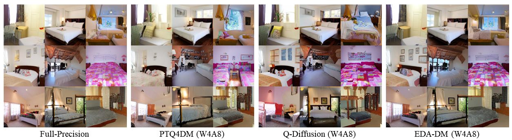

# 🚀EDA-DM: Enhanced Distribution Alignment for Post-Training Quantization of Diffusion Models 

<h5 align="center">

[](https://arxiv.org/abs/2401.04585)
[](https://github.com/BienLuky/EDA-DM)
 <br>

</h5>


## 📖Introduction
EDA-DM is a novel post-training quantization method for accelerating diffusion models. In the low-bit cases, it maintains high-quality image generation without any computational overhead. 
To address the distribution mismatch issues at both calibration sample level and reconstruction output level, we propose TDAC to address the calibration sample level mismatch, and propose FBR to eliminate the reconstruction output level mismatch.

🔹Challenges
<div align=center>
  
</div>

🔹Overview Methods
<div align=center>
  
</div>


*This repository provides the official implementation for EDA-DM **calibration, training, inference, and evaluation without any reservation.***

## 🔓Getting Started

### 🗝️Installation

Clone this repository, and then create and activate a suitable conda environment named `EDA-DM` by using the following command:

```bash
git clone https://github.com/BienLuky/EDA-DM.git
cd EDA-DM
conda env create -f env.yaml
conda activate EDA-DM
```

### 🔧Usage

1. For Latent Diffusion and Stable Diffusion experiments, first download relevant checkpoints following the instructions in the [latent-diffusion](https://github.com/CompVis/latent-diffusion#model-zoo) and [stable-diffusion](https://github.com/CompVis/stable-diffusion#weights) repos from CompVis. We currently use `sd-v1-4.ckpt` for Stable Diffusion. 

2. Then use the following commands to run:

```bash
# CIFAR-10 (DDIM)
bash scripts/for_cifar.sh

# LSUN Bedroom (LDM-4)
bash scripts/for_bedroom.sh

# LSUN Church (LDM-8)
bash scripts/for_church.sh

# ImageNet (LDM-4)
bash scripts/for_imagenet.sh

# COCO (Stable Diffusion)
bash scripts/for_coco.sh
```

### 💠EDA-DM Weights
Here, we provide some EDA-DM quantized weights.
Due to the space limitations of Google Drive we only provide partial weights.

| Model | Dataset | Prec. | Link |
| ------- | ------- |------- |------- |
|  DDIM  | CIFAR-10 | W4A8 | [link](https://drive.google.com/file/d/1C7K3VbhkB-GKbI33cvoPBqRKYWBYb0RC/view?usp=drive_link) |
|  LDM-4  | ImageNet | W4A8 | [link](https://drive.google.com/file/d/1xqkm7hcuOfMby0VhMIZcY3iOkDfnFmaG/view?usp=drive_link) |


### 📝Evaluation
We provide the evaluation code in `scripts/test.py`. But before using it you need to download [torch-fidelity](https://github.com/toshas/torch-fidelity), [pytorch-fid](https://github.com/mseitzer/pytorch-fid) and [clip-score](https://github.com/Taited/clip-score) to `EDA-DM`.

## 🔍Details

EDA-DM follows a standard post-training quantization (PTQ) pipeline, which first collects a small calibration and then optimizes quantization parameters via reconstruction-based training. Notably, many existing approaches design time-step quantization parameters for diffusion models, which significantly improve performance but at the cost of deployment efficiency. **In contrast, our method adopts a single quantization parameter shared across all diffusion steps.** Experiments demonstrate that EDA-DM not only achieves superior quantization performance but also maintains high deployment efficiency.

## 🛠️Deployment
The quantized models are deployed by utilizing [CUTLASS](https://github.com/NVIDIA/cutlass) and the same deployment toolkit of [SmoothQuant](https://github.com/mit-han-lab/smoothquant). 
The specifical implementation is based on the open-source project [torch_quantizer](https://github.com/ThisisBillhe/torch_quantizer).


## 📊Result

### 🔹Random samples 
  <details>
  <summary> Stable-Diffusion (1.83× Acceleration)</summary>
  <div align=center>
  Random samples on COCO.
    
  </div>
  
  <div align=center>
  Random samples on DrawBench.
    
  </div>
  </details>


  <details>
  <summary> LDM-4-ImageNet (1.88× Acceleration)</summary>
  <div align=center>
    
  </div>

  </details>


  <details>
  <summary> LDM-4-Bedroom (1.78× Acceleration)</summary>
  <div align=center>
    
  </div>

  </details>
  

  <details>
  <summary> LDM-8-Church (1.75× Acceleration)</summary>
  <div align=center>
    
  </div>

  </details>


### 🔹Compression and Speedup
We deploy the quantized models on RTX 3090 GPU, CPU, and ARM.
  <div align=center>
    
    
  </div>


## 💙Acknowledgments

This code was developed based on [Q-diffusion](https://github.com/Xiuyu-Li/q-diffusion) and [BRECQ](https://github.com/yhhhli/BRECQ). 
We thank [torch_quantizer](https://github.com/ThisisBillhe/torch_quantizer) for providing the reference to deploy our quantized model and measure acceleration. We also thank [torch-fidelity](https://github.com/toshas/torch-fidelity), [pytorch-fid](https://github.com/mseitzer/pytorch-fid), and [clip-score](https://github.com/Taited/clip-score) for IS, sFID, FID and CLIP score computation.


## 📚Citation

If you find this work useful in your research, please consider citing our paper:

```bibtex
@article{liu2024enhanced,
  title={Enhanced distribution alignment for post-training quantization of diffusion models},
  author={Liu, Xuewen and Li, Zhikai and Xiao, Junrui and Gu, Qingyi},
  journal={arXiv e-prints},
  pages={arXiv--2401},
  year={2024}
}
```